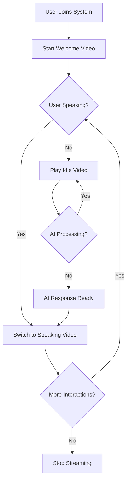

# Video Streaming Workflow

## State Transitions

1. **Welcome State**: When user first connects
2. **Idle State**: When user is not speaking
3. **Speaking State**: When user is speaking or AI is responding
4. **Processing State**: When waiting for AI response (uses Idle video)

## Key Features for Seamless Transitions

- **Consistent Encoding**: All videos encoded with same settings
- **Proper GOP Alignment**: GOP size of 50 frames for smooth switching
- **Fast Encoding**: Ultrafast preset with zerolatency tuning
- **Graceful Process Management**: Previous FFmpeg process properly terminated before starting new one
- **Transition Locking**: Prevents multiple simultaneous transitions
- **Looping**: Videos loop continuously to prevent gaps